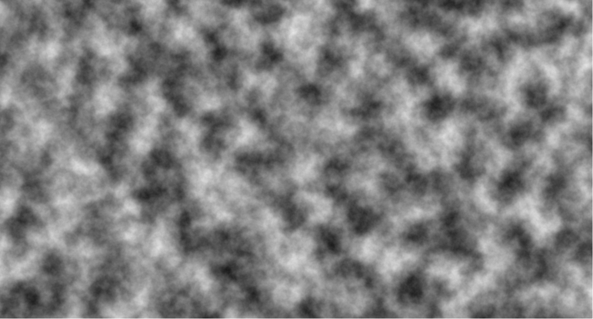
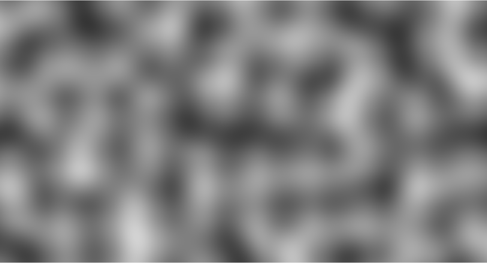
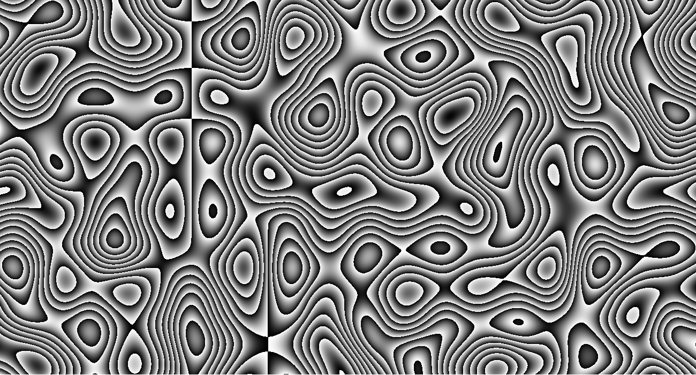
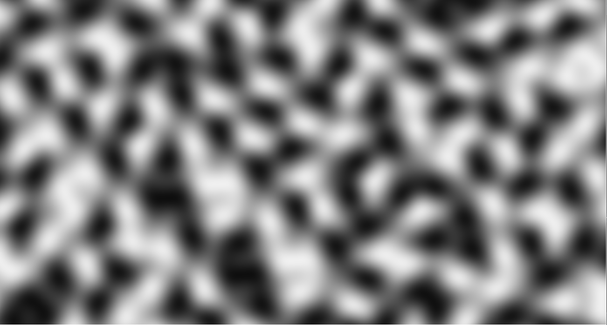
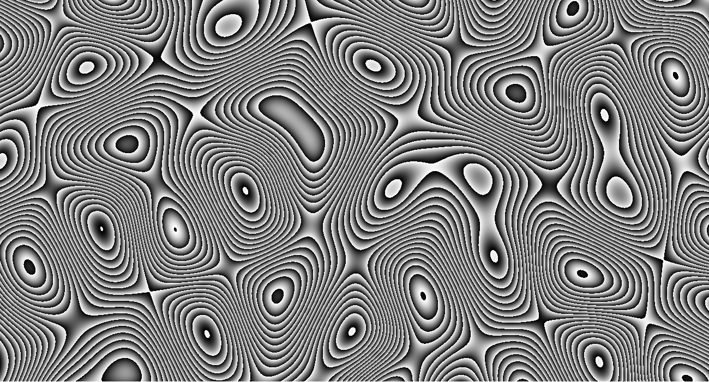

# Perlin & Simplex_noise

Implementation of the Perlin noise, and then of the Simplex noise.

There is several function that you can use to visualize the noises with different settings to obtain different results.
There is 2 function that allow a "3d" visualization, where you travel slice by slice into the noise.

Result using the firelike function :

Result using Perlin noise, a 0.007 scale and a blurr of 1 :

Result using Perlin noise, a 0.007 scale and a blurr of 20 for a woodlike result :

Result using Simplex noise, a 0.007 scale and a blurr of 1 :

Result using Simplex noise, a 0.003 scale and a blurr of 20 for a woodlike result :

